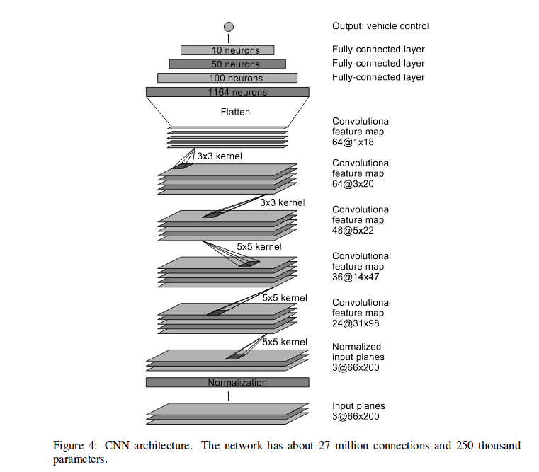
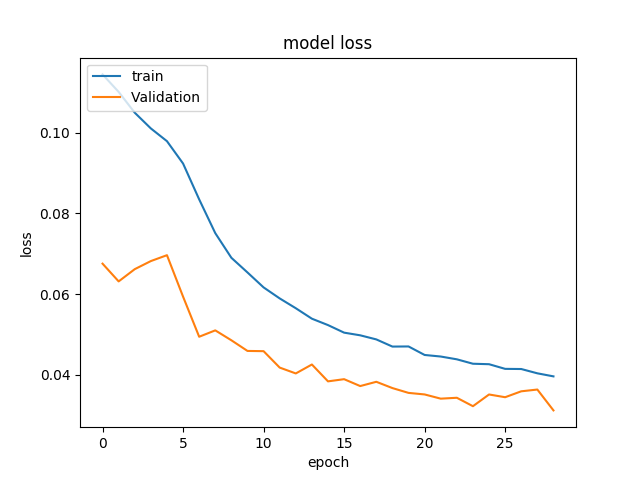
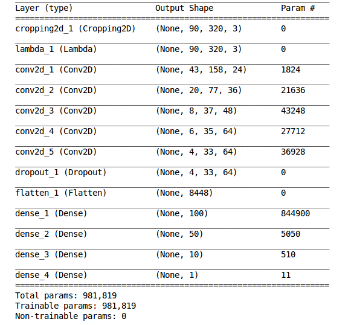
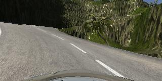
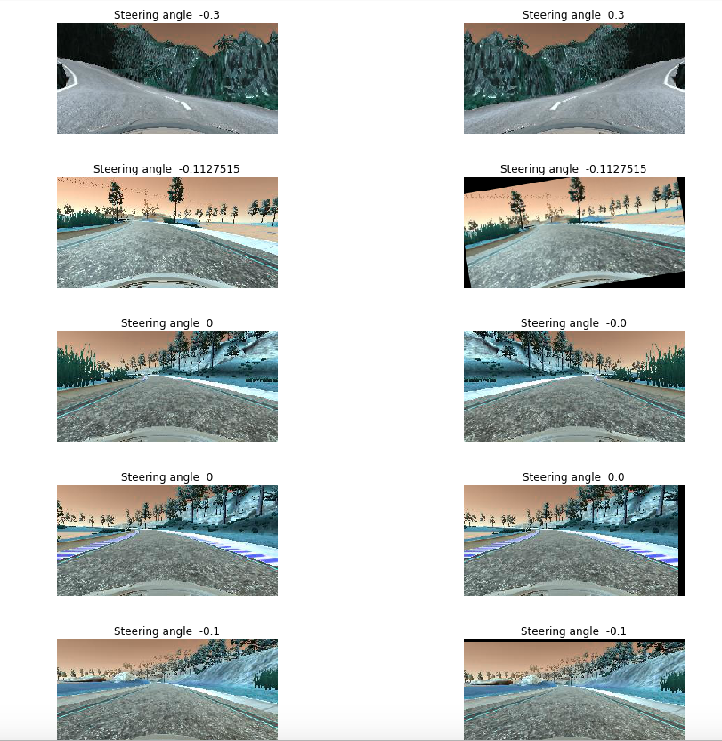

# **Behavioral Cloning** 

## Writeup Report Behavioural Cloning project

---

**Behavioral Cloning Project**

The goals / steps of this project are the following:
* Use the simulator to collect data of good driving behavior
* Build, a convolution neural network in Keras that predicts steering angles from images
* Train and validate the model with a training and validation set
* Test that the model successfully drives around track one without leaving the road
* Summarize the results with a written report


## Rubric Points
### Here I will consider the [rubric points](https://review.udacity.com/#!/rubrics/432/view) individually and describe how I addressed each point in my implementation.  

---
### Files Submitted & Code Quality

#### 1. Submission includes all required files and can be used to run the simulator in autonomous mode

My project includes the following files:
* __model.py__ contains the script to create and train the model, it also contains the utilities needed for preprocessing and Data Generation and Augmentation.
* __video.mp4__ a video showing the car running in autonomous mode on track 1.
* __drive.py__ is unchanges, exactly as provided by the Udacity.
* __model.h5__ containing a trained convolution neural network 
* __writeup_report.md__ summarizing the results

#### 2. Submission includes functional code
Using the Udacity provided simulator and my drive.py file, the car can be driven autonomously around the track by executing 
```sh
python drive.py model.h5
```

#### 3. Submission code is usable and readable

The model.py file contains the code for training and saving the convolution neural network. The file shows the pipeline I used for training and validating the model, and it contains comments to explain how the code works.

### Model Architecture and Training Strategy

#### 1. An appropriate model architecture has been employed

As the base model I used Nvidia model described in the paper [End-to-End Deep Learning for Self-Driving Cars](https://arxiv.org/pdf/1604.07316v1.pdf). 

The figure below is the model architecture that I used


The model consists of 5 convolutional layers, the first three have kernel size of ```5 x 5``` ensuring a wider look into the input image, and 24, 36, and 48 filters respectively. The last two convolutional layers have the kernel size ```3 x 3``` and 64 filters each.  All the convolutional layers use **Elu** activation function to ensure non-linearity. The output of the last convolutional layer is Flattened. Next we add fully connected layes to perform the task of regression based on the features extracted by convolutional layers.
There are four fully connected layers with neurons 100, 50 10 and 1 respectively.

I also hard wired both Cropping (model.py line 107) and Normalization (model.py line 110) in my model so that the process can make use of the GPU speed. 

The complete model is defined in the model.py file in lines 104-131. 


#### 2. Attempts to reduce overfitting in the model

Overfitting is a common problem, to ensure that overfitting does not happen, from the starting I used following methods:

* Between the convolutional layers and Dense layers I added a Dropout layer, according to the paper [Dropout:  A Simple Way to Prevent Neural Networks from Overfitting](http://www.jmlr.org/papers/volume15/srivastava14a/srivastava14a.pdf?utm_content=buffer79b43&utm_medium=social&utm_source=twitter.com&utm_campaign=buffer). the dropout layer helps in overcoming overfitting. During training some of the connections are off, thus ensuring remaining weights learn the feature represenataion.

* The dataset was divided into training and validation set. As the training went both training and validation loss were considered, and the model with best performance, that is least validation loss was saved.

* I also used Data Augmentation on the training dataset  (function ```data_generator``` defined in model.py lines 58-93), this helps by making the system robust. According to this paper [The Effectiveness of Data Augmentation in Image Classification using Deep Learning](http://cs231n.stanford.edu/reports/2017/pdfs/300.pdf) augmenation improves the performance by taking care of insufficient information, also since random distortions are introduced in the training dataset this ensures that model does not overfit. While according to the paper neural augmentation gives best result for simplicity I used traditional augmentation methods and performed random horizontal flip, rotation, horizontal and vertical shift and change in brightness (the random distortions were added using function ```distort_random``` defined in model.py lines 29-54). 

After the network was trained the generated model was used to test on track 1, below is the you tube link to that video. As you can see, the car succesfully completed the lap, but there are many places where it is almost on the boundary and might leave the track, had I been sitting in the car would have been terrified :smiley:.

<a href="http://www.youtube.com/watch?feature=player_embedded&v=wdtUOWjxPIQ
" target="_blank"></a>


#### 3. Model parameter tuning

The model used an adam optimizer, so the learning rate was not tuned manually (model.py line 134).

#### 4. Appropriate training data

Training data was chosen to keep the vehicle driving on the road. I used a combination of center lane driving, along with it the left and right camera positions with high correction in the steering angle to train the model.

In my opinion sufficient amount of this sort of data should be sufficient for end to end training.

For details about how I created the training data, see the next section. 

### Model Architecture and Training Strategy

#### 1. Solution Design Approach

From starting to deal with the problem of overfitting i had my dataset split into training (80%) and validation set (20%). The MSE loss of training and validation dataset enables us to know if our model is overfitting or underfitting. 

Initially I experimented with a very simple MLP model and used only center camera image, it was utter failure the car just kept moving in circles. Then as I added the CNN layers the car started to stay more on road, but was still not able to handle curves. With the introduction of **Nvidia Dave model** the performance improved further, it could maneuvre soft turns, but now car was failing at sharp turns.
This forced me to look at my training data. From the plot of training and validation loss, I knew the problem is not of overfitting, but instead the model has not learned to take sharp turns, which were at times necessary.



To teach model sharp turns the training dataset needs sufficient sharp turns, one way to generate this was driving zig-zag fashion, and so getting large turns, but this could lead the model to learn to drive in zig-zag and not straight, so I decided against it.

Instead I decided to use the left and right camera images along with corrected steering angle. the correction in steering anfle took sometime to optimize but finally a correction of 0.35 seemed a good option.


The final step was to run the simulator to see how well the car was driving around track one. There were a few spots where the vehicle almost was going off the track, but it saved itself everytime. Still, had I been sitting on the car that would have given me serious heart attacks!! 

But still it is remarkable that at the end of the process, the car was able to drive autonomously around the track without leaving the road. :muscle:

The things which I will try to improve my model given sufficient time (On my ```GTX 1070``` 30 epochs took about 3 hours) are:

1. Since both validation and training loss were still decreasing, increasing the epochs will help in making the model learn further.
2. Right now we have only two tracks, increasing the dataset will definitely help.
3. I will try BatchNormalization instead of Dropout, it seems to give good results in classification tasks, it may help here as well.


#### 2. Final Model Architecture

The final model architecture (model.py lines 104-131) consisted of a convolution neural network with the following layers and layer sizes.




#### 3. Creation of the Training Set & Training Process

To capture good driving behavior, I first had two laps on track-one recorded using center lane driving. Here is an example image of center lane driving:


I repetaed the center lane driving on track 2 later





This resulted in total 5311  center images from track 1, 7099 images from track 2. I also used the sample dataset provided by Udacity containing 8036 center images. Making a total of 5311+7099+8036=20446 center camera images

While the lecture suggested that I record the vehicle recovering from the left side and right sides of the road back to center so that the vehicle would learn to recover, I tried doing it, but it ended the car running in zig zag fashion on the road, and I feared the model will learn this behaviour. 

So instead I used left and right camera images with a little high correction factor. This provided me with ```20446*3=61338``` images. it is a good number. These images were shuffled and split into training and validation set using Scikit ```train_test_split``` function, with 80% training datset and 20% Validation dataset.

Finally to increase the robustness of my model, I decided to Augment the dataset with following tradition augmentations:
* Rotation
* Horizontal Flip (here the steeering angle should also invert)
* Intensity change
* Horizontal and Vertical shift.
Below you can see the original image (Left) and the corresponding augmented images (Right) for some random training dataset images.




For augmentation I created a generator function which will continue the process indefinitely, and called it at the time of fitting the model using Keras ```fit_generator``` method.

Using Adam optimization the network was finally trained for 30 epochs.
